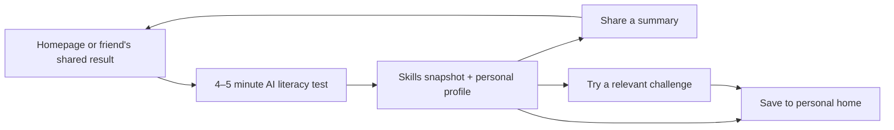

# The five-minute Foray experience

Status: approved product direction, with a first local demo implemented. This is not a validated instrument.
Decisions from the product discussion on 2026-09-12: the main entry point is an AI literacy
test; a complete first experience targets 4–5 minutes; the result combines demonstrated
skills with a memorable personal profile. Image practice supports this journey.

## The product promise

Find out how you work with AI, what you noticed, and what to try next.

The homepage should sell that result and send visitors directly into the test. A practice
round should not be a prerequisite. The full research examination remains available as
an advanced experience; it is not the consumer test with longer timers.

The reference is 16Personalities. Its homepage leads with a personal outcome, a ten-minute
commitment, and a test CTA. Its Japanese team page extends individual assessment into
reports and guided workshops. The useful design hypothesis for Foray is that a personally
meaningful result can motivate starting, sharing, and returning. Those pages do not prove
which design choices cause conversion, and their accuracy claims are not evidence for ours.

Sources inspected 2026-09-12:
- [Consumer homepage](https://www.16personalities.com/)
- [Test introduction](https://www.16personalities.com/free-personality-test)
- [Japanese team assessment](https://www.16personalities.com/ja/%E3%83%81%E3%83%BC%E3%83%A0%E8%A9%95%E4%BE%A1)

## The main journey

Home → test → personal result → save or share → a recommended follow-up activity.
A shared result has its own invitation into the same test. Returning visitors see their
last result, any unfinished attempt, and one next activity.

Header: Mission, My activity, and Take the test, with an account control when accounts are available. Research remains accessible by its existing routes.
Inside the test: progress, save-and-exit, and the current situation. No competing app tabs.
Research, technical validation, and the long examination remain discoverable in the footer.

The homepage previews an explicitly labeled example result and a sample task. Its primary
CTA is the test. A sample task does not open a competing practice funnel. The mission explains
why participation matters below the immediate personal benefit.

## A candidate first test

Use a short, coherent project that makes sense without professional AI experience. One
candidate is preparing a small community event with an AI assistant. This theme needs
user testing across backgrounds and languages. It is not an assumed universal context.

| Situation | What the person does | Evidence it can provide |
|---|---|---|
| Give direction | Choose a useful delegation and improve a brief with missing constraints | Goal framing and delegation decisions |
| Check the work | Compare an assistant recommendation with a small source sheet; accept supported details and flag unsupported ones | Verification and appropriate trust |
| Improve the output | Review a draft or visual against the brief and choose a specific revision | Evaluation against intent and iteration decisions |
| Decide what happens next | Review an agent's proposed action involving recipients, files, or publication | Oversight, data handling, and when approval is needed |

Target roughly 45–60 seconds per situation, plus a brief introduction and result transition.
That is a design budget, not a claim about observed completion time. Roughly 8–12 meaningful
choices is a starting prototype constraint. Reading burden, mobile interaction, and assistive
technology access determine whether it fits. No visible countdown and no speed-based skill score.

Use concrete artifacts, selectable text, comparisons, and short decisions. Do not require a
long essay, a personal API key, a model selection screen, or an account before starting.
A small optional free-text interaction can be explored, but the first result must not depend
on an untested LLM judge. Choosing a revision demonstrates recognition of a useful revision;
it does not prove that the person can independently write one. Result language must say so.

Delay answer explanations until the end of the assessed sequence so one explanation does not
teach the answer to a later item. Practice afterward can give immediate feedback.

## The result is the center of the app

Show the full basic result before asking for an account:
1. A character and a short profile framed as how the person approached this run.
2. Observed strengths and missed opportunities tied to specific decisions.
3. A compact skills snapshot, with insufficient evidence explicitly marked.
4. One relevant follow-up challenge, then optional saving and sharing.

Do not infer a permanent personality from a few choices. Do not convert this short test into
the existing examination's composite or credential. No population percentile without a valid
reference sample. Avoid precise-looking ability percentages from a handful of observations.

Reuse the existing character artwork where it fits, but evaluate a smaller set of profile
families before insisting on all sixteen. Profiles should describe approaches without treating
one as the winner. Mixed evidence can produce a mixed description instead of a forced type.

An account preserves access across devices and collects later attempts. Sign-in returns to the
result the visitor just earned, then to their personal home on later visits. Claiming a guest
attempt must prove possession of its scoped capability; accepting a client-supplied attempt ID
alone is not ownership. Never require email to reveal a result already earned.

A shared card shows a profile and selected summary, not raw answers. The recipient can take
the test without joining the sender's account or seeing private evidence. Sharing is opt-in.

## Architecture

The current implementation is centered on a four-track sitting. `apps/web/app/exam/page.tsx`
coordinates clocks, model connections, track transitions, persistence, and finalization.
`packages/session/src/machine.ts` models that sitting. `packages/report/src/playerType.ts`
expects all four track scores and can fall back to demo-cohort medians for missing behavioral
signals. That mapping is unsuitable for a new five-minute assessment.

The existing demo budgets in `packages/report/src/tracks.ts` total 33 minutes. The formal
research sitting is much longer. `docs/SHORT-FORM.md` proposes a 53-minute panel form, not a
consumer flow. None of these is the proposed four-situation test.

Create a distinct consumer assessment model rather than changing the meaning of stored exam
attempts or passing short-test answers through the old composite. Reuse content addressing,
persistence patterns, accessibility primitives, and share rendering where their contracts fit.
Do not introduce a generic workflow platform to implement four interaction shapes.

| Responsibility | Owner and intended behavior |
|---|---|
| Test UI | A focused frontend feature with four reusable interaction shapes and one shell. Proposed `/test` entry point; existing `/exam` continues to mean the full sitting. |
| Assessment definition | Versioned form containing situations, presentation order, response schemas, and evaluator version. Operational keys and rubric detail stay in the private backend. Public demo content remains a separate released tier. |
| Attempt lifecycle | Separate consumer state model: in progress, submitted, result available. Append responses, persist the form version, resume on reload, and make submission idempotent. |
| Skill evaluation | Pure derivation in shared `packages/`, authored here and vendored to the backend. The service computes hosted results from accepted evidence; the browser renders them. |
| Profile presentation | Separate from ability scoring. Version the mapping, retain the observed basis, and allow mixed or insufficient evidence. Never fill missing short-test evidence with demo-cohort medians. |
| Backend | The private exam service owns anonymous attempt capabilities, rate limits, operational content, result persistence, account claiming, and sharing. Add no API handlers or secrets to this frontend repository. |
| Personal home | One place for an unfinished test, past results, and suggested practice. Existing daily and image activities appear here rather than as equal primary navigation destinations. |

For the initial form, use reviewed, stored AI outputs and deterministic evaluation of the
choices. This makes the first result available without model latency or provider setup. The
interaction must be identified as a scenario, not falsely presented as a live conversation.

Live AI can power subsequent exploratory practice, within a server-side cost budget. If it later
enters assessment, freeze the exact output shown as evidence and validate the evaluation. A model
outage must not silently substitute a different condition while issuing the same kind of result.
Re-scoring stays reproducible; re-judging is not.

Keep durable skills separate from the examples used to exercise them. Updating a reviewed brief,
artifact, or model-output fixture should be a content version change, usually not a new React
component. New interaction shapes need code and accessibility review. Compare results across
versions only when there is evidence supporting that comparison. Do not have an LLM invent a
new scored test for every visitor.

## The return loop and public mission

The initial result recommends one activity relevant to something the visitor missed or wanted
to explore. A later fresh assessment gives another observation; improved familiarity alone is
not evidence of skill improvement. Daily challenges are an optional return path, not the purpose
of the product.

Teams and communities can be a later extension: invite participants, let them opt into sharing,
and discuss complementary approaches. Do not make organization creation the first consumer
experience just because the supplied reference includes a team product.

Separate optional research participation from receiving a personal result. Convenience-sample
traffic does not become a national literacy estimate. Keep the sampling distinction already
recorded in `docs/SAMPLING.md`.

## How to test this direction

First prototype the complete arc, including its result, with one reviewed four-situation form.
A polished homepage without a finishable, satisfying test repeats the last mistake.

Use observed task completion to evaluate whether 4–5 minutes is feasible. Ask participants what
the result says about them and whether they can identify the evidence. Test whether they can
find their result again and what a shared recipient understands before starting.

Measure starts per eligible visit, completions per start, time to result, result comprehension,
and completion by visitors arriving through a share. Evaluate returning use separately from raw
page views. Do not claim maximal engagement before observing it. Derive assessment drop-off from
its own attempt records; keep answers, raw transcripts, and share tokens out of analytics.

Implementation order after validating the experience:
1. Prototype the full short test and evidence-backed result using explicitly public demo content.
2. Implement and test the separate form, response, evaluation, and result contracts.
3. Add private-service persistence, scoped guest access, account claiming, and opt-in sharing.
4. Point the main CTA at the tested flow and connect results to existing follow-up activities.

Verification includes branching coverage, partial and resumed attempts, repeated submission,
missing evidence, keyboard and screen-reader flow, mobile layouts, unavailable service states,
account ownership, share privacy, and both frontend build modes. All existing exam and public-bank
separation gates continue to apply.

## First local implementation — September 12, 2026

The homepage now leads to `/test`: eight public, reviewed decisions across direction, verification, revision, and oversight. The result includes observations, a provisional profile, explanations, a self-guided exercise, and a copyable invitation. `/me` resumes incomplete attempts and reopens completed results. History stays in this browser; unreadable data is preserved and storage failures show an unsaved-session notice.

This is the first complete local prototype of the approved journey. The 4–5 minute duration is a design target, not a measured completion time. The scenarios test recognition of useful decisions rather than independent task performance. They are not operational examination content or a validated literacy measure. Account sync, public result pages, exercise history, alternate forms, and consented service analytics remain future work in their appropriate repositories.

## Interface copy

Keep activity screens brief: one instruction, the action, and only the context needed to choose. Put research, evidence limits, and background explanations behind a clearly named disclosure or on the methods and result pages. Avoid repeating the same caveat in several sections. The practice page keeps its exam-separation note to one line and groups background material under “About this practice.”

### Profile stat card

The activity card displays six signals: briefing, delegation, checking, refinement, boundaries, and follow-through. They partition the existing eight decisions into groups of 1, 1, 2, 2, 1, and 1. Each label shows the observed count; the hexagon uses the fraction within that group. These are finer views of the same evidence, not six newly validated abilities. The broader four skill groups still determine the provisional profile and next exercise.
