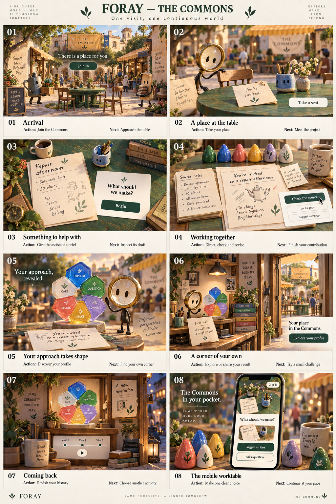

# Foray: one visit to the Commons

Concept storyboard, version 1. This is a visual direction for review, not an implemented interface.

## The world

A welcoming miniature commons where human choices shape useful work. Painted wood, folded paper, ceramic and brass give the environment a tactile character. Forest green anchors a brighter palette of cobalt, coral, ochre and lilac. The inhabitants are original instrument characters. A small magnifying-loupe companion guides the first visit.

One square, one communal table and one personal corner connect the journey. The first story is a community repair afternoon. A paper invitation travels through the experience, while six colored pieces become a profile sculpture at the reveal.

## Eight frames

| Frame | Composition and action | Transition |
|---|---|---|
| 01 Arrival | Wide view of the square. Inhabitants prepare the repair afternoon. One empty chair is clearly yours. “There is a place for you.” **Join in.** | A short camera move approaches the communal table. |
| 02 A place at the table | The loupe companion pulls out a chair. Notes and a small assistant device await you. **Take a seat.** | The camera settles above the tabletop; surrounding activity becomes quiet. |
| 03 Something to help with | Source notes establish Saturday, 2–4 pm, and 20 places. You give the assistant a useful brief. **Begin.** | The assistant produces a draft on a paper card. |
| 04 Working together | Direct, verify, revise and approve through eight decisions. Source notes and drafts remain readable. **Check the source.** | Cards move and revisions appear. Movement acknowledges the choice without revealing whether it matched the scoring key. |
| 05 Your approach takes shape | The completed invitation rests on the table. Six colored pieces assemble into a profile sculpture beside your character. **Your approach, revealed.** | The camera reveals a personal nook connected to the square. |
| 06 A corner of your own | Your character, sculpture and first dated keepsake occupy the nook. **Explore your profile.** Sharing and a relevant follow-up are available. | Finishing or leaving preserves the recorded visit according to the available storage mode. |
| 07 Coming back | Return directly to your nook. Select past visits with a slider or play them. The sculpture morphs as one shape, with no historical ghosts. **A new invitation.** | Choose another activity from the nearby notice board. |
| 08 The mobile worktable | A top-down table with a compact source card, assistant draft and stacked choices. Progress stays visible. | Advance one decision at a time without navigating a 3D world. |

## Motion and interaction

Arrival, approaching the table and the profile reveal carry the largest movements. During decisions the camera remains still. Text and controls stay screen-aligned, legible and usable with keyboard or touch. No walking controls are required to take the test. Reduced-motion mode uses direct cuts and stable compositions. Decorative assets must not prevent starting an activity.

The square's inhabitants are authored scenery, not evidence of real people online. No counters or visitor avatars imply participation that has not occurred. A weak result never damages the commons or disappoints its inhabitants. Missing a day never degrades a personal space.

The profile sculpture illustrates the recorded observations; the evidence and exact values remain available in the result. The first demo has eight decisions, not six independently validated abilities. Animation must not imply improved ability merely because someone repeats questions.

The ceramic sculpture is a material study, not a replacement for the agreed filled radar chart. The next profile design must retain a single filled area that smoothly changes with the history slider. The labels in the artwork are illustrative and do not define new metrics.

## Review before implementation

- Does the setting feel welcoming to adults rather than aimed at children?
- Are arrival, activity and personal profile recognizably in the same place?
- Can the primary action be understood immediately in each frame?
- Does the loupe companion feel distinct enough to belong to Foray?
- Does the mobile frame preserve the atmosphere without adding navigation work?

Detailed assessment UX, numerical visualization and storage behavior require a separate design pass. The concept art's text and sculpture are illustrative, not production specifications. No application code changes are part of this storyboard.
