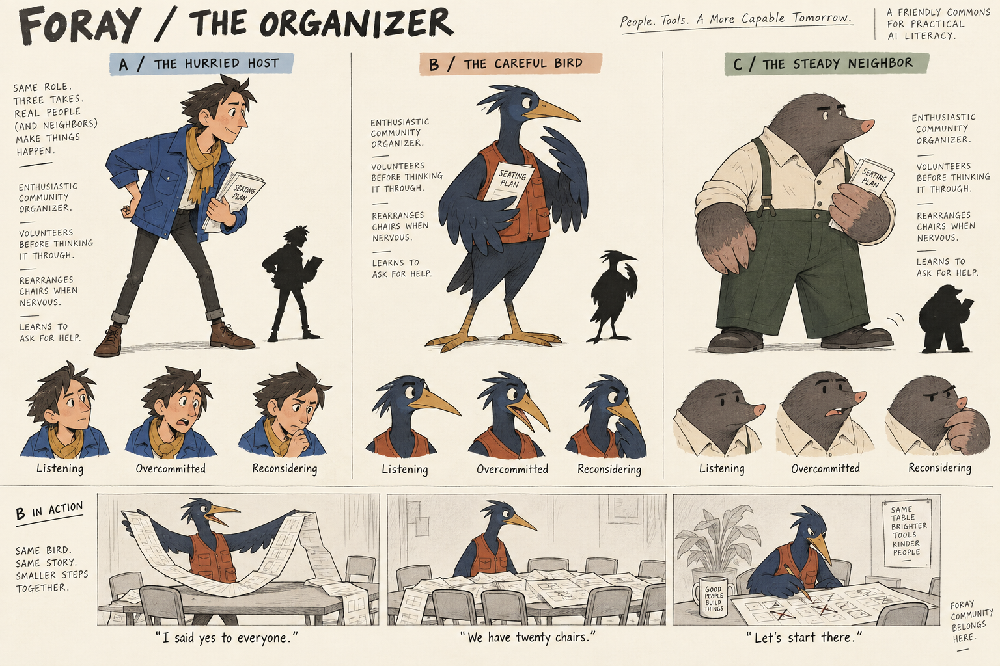

# Organizer exploration, version 1

These are alternatives for one role, not an approved cast. Made with the built-in image-generation tool. No application assets or code changed.

## Character brief

The organizer wants everyone to feel invited and commits before checking the practical details. They rearrange chairs when nervous. The visitor helps them make a workable plan. Their response to correction is a pause, then practical action, rather than praise or embarrassment directed at the visitor.

A explores a human host; B explores an expressive bird; C explores a sturdy mole. B has the strongest acting range in this sheet. C has the clearest compact silhouette. Neither is approved.

## Critique and next pass

The generated sheet adds unwanted slogans and excess annotations despite the brief. Ignore these as brand copy. The silhouettes need further simplification for small screens, especially feathers and clothing detail. The last acting panel does not visibly include the visitor as requested. Future acting studies should show collaboration, not a solitary task.

Choose the underlying silhouette before naming or rendering the character. Then refine front, side and back views, expressions, hands, gait and two ordinary habits. Establish shared eye construction, proportions, contour treatment and material rules before expanding the cast. This is our proposed design process, not a claim about another studio's production process.

## Generation prompt

Use case: stylized-concept
Create an intentional 2D character-development sheet for Foray, a welcoming adult-friendly game-like Commons for practical AI literacy. This is a rough visual development exercise, not polished marketing art. Landscape sheet, warm plain off-white background, charcoal pencil outlines, flat limited color, ample whitespace, strong readable silhouettes. No cinematic scenery or 3D rendering.
Title: "FORAY / THE ORGANIZER"
Three columns explore THREE ALTERNATIVE DESIGNS FOR THE SAME ROLE, not three members of a cast. Role: an enthusiastic community repair-event organizer who volunteers before thinking through details, rearranges chairs when nervous, and learns to ask for help. Warm but occasionally flustered, observant eyes, no permanent grin. Original characters, do not copy any existing game character.
Column A label "A / THE HURRIED HOST": human adult, compact broad bean-shaped torso, angular swept hair, long thin legs, boxy cobalt work jacket, short ochre scarf tucked away. Forward-leaning posture, one eyebrow raised. Distinct asymmetry and angular nose, small eyes. Carry one folded seating plan. No cute baby proportions.
Column B label "B / THE CAREFUL BIRD": original anthropomorphic ground bird adult, long wedge-shaped beak, upright narrow pear body, low swept crest, broad flat feet, rust sleeveless work vest over ink-blue plumage, wings used expressively. Pauses mid-gesture to reconsider. No owl, no existing franchise resemblance. No accessories except folded seating plan.
Column C label "C / THE STEADY NEIGHBOR": original anthropomorphic sturdy mole adult, low broad trapezoid body, small blunt snout, tiny eyes under straight brows, enormous spade-shaped hands, cream rolled sleeve shirt and deep green trousers. Dry humor, calm face but one foot tapping. No goggles or hats. Folded seating plan.
In each column show a large three-quarter full body with a small solid black silhouette alongside, then three small consistent expression heads captioned "Listening", "Overcommitted", "Reconsidering". Expressions must vary through eyes/brows/mouth, not emoji symbols.
At bottom full width show a simple three-panel pencil acting strip using ONLY character B with consistent anatomy: enthusiastically unfolding an impossibly long seating plan; pausing and looking sideways when the plan covers the table; sitting beside the visitor and crossing out unnecessary chairs. Short captions exactly "I said yes to everyone." / "We have twenty chairs." / "Let's start there."
Graphic quality: disciplined editorial animation model sheet, economical contours, specific poses, imperfect human pencil marks, flat restrained color fills. Avoid plush toy feel, glossy eyes, chibi, generic smiling mascots, floating sparkles, clay materials, gradients, inspirational slogans. This sheet should expose design decisions instead of using finish to hide them.
