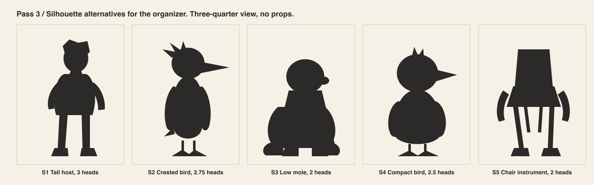
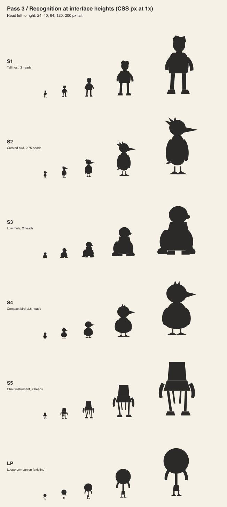
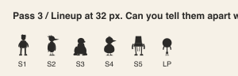
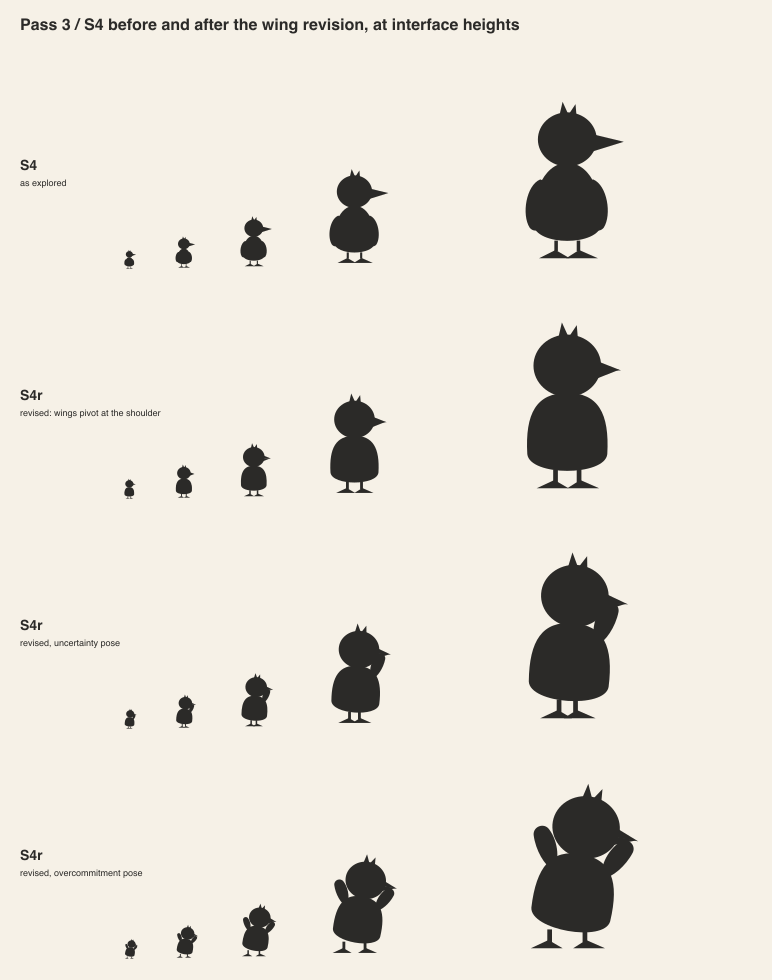
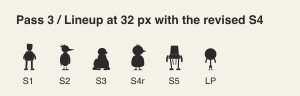

# Pass 3 / Silhouette and shape language

Author: AI in the role of concept artist.
Reviewer: AI in the role of art director, in a separate step. Not human professional review.

## Alternatives

Five silhouettes for the same role, drawn in solid black with no props. Three-quarter view,
because that is the storyboard's camera.

| Key | Shape | Heads tall |
|---|---|---|
| S1 | Tall human host, bean torso, angular hair | 3.0 |
| S2 | Crested bird, narrow pear, long beak | 2.75 |
| S3 | Low mole, trapezoid, spade hands | 2.0 |
| S4 | Compact ground bird, egg body, one tuft | 2.5 |
| S5 | Folding-chair instrument character | 2.0 |

## Recognition at interface heights

Each silhouette rendered at 24, 40, 64, 120 and 200 CSS pixels, plus the existing loupe
companion for comparison.

## Findings

- **S1** reads as a person at every size. It reads as any person. The hair notch is the
  only identity and it vanishes at 24 px.
- **S2** loses the crest below 64 px, where it becomes fuzz on the head. The prior
  critique in `../ORGANIZER-EXPLORATION.md` predicted this. The beak still reads.
- **S3** reads as a mound below 64 px. The snout is too small to read and the hands merge
  with the body. The shape is calm, and calm is not this character.
- **S4** reads at every size. The wedge beak is a pointer and the tuft is a single notch.
  Both survive 24 px. The wings do not read at all, because they hug the body.
- **S5** reads as furniture at every size. The arms read as ears. It would also compete
  with the scenery chairs the organizer rearranges. Rejected.
- **Loupe** is a circle on a stick and is distinct from all five. S4 is the closest,
  because both are round on legs. The beak and the wedge feet separate them.

## Selection and revision

The art director selected S4 on readability and on the beak as a personality carrier.
One revision was required before acceptance. The wings must break the outline. Otherwise the
character has no acting range in silhouette. The revision pivots both wings at the
shoulder, held slightly away from the body.

The revised S4 keeps its read at 24 px in the neutral pose. The uncertainty pose reads
from 40 px. The overcommitment pose reads from 40 px. At 24 px, poses collapse to a blob
with a bump. The interface must not rely on pose at that size.

## Not yet decided

The character has no name. The exploration doc asks for a silhouette before a name, and
this pass stops there.
