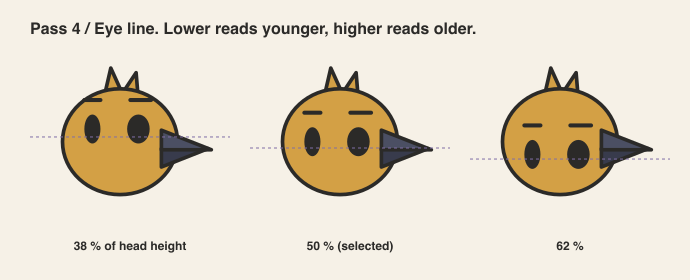
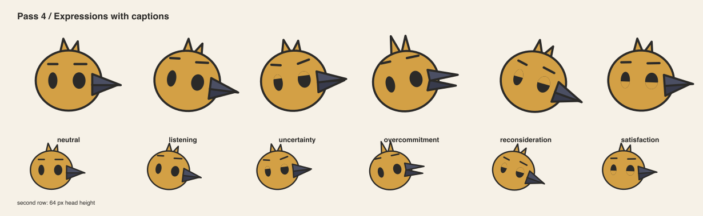
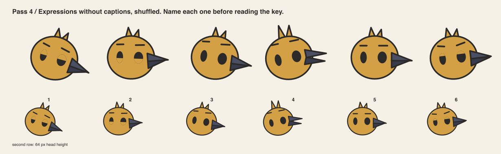
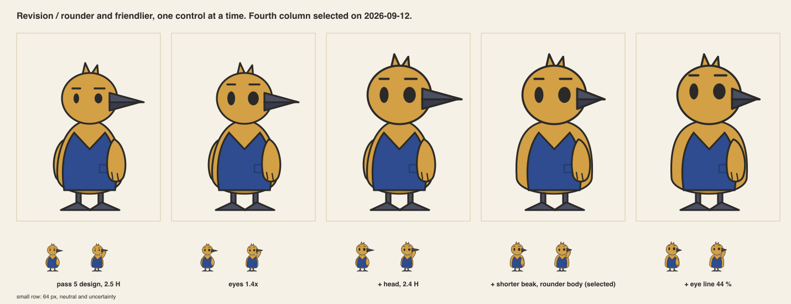

# Pass 4 / Proportion and face studies

Author: AI in the role of character designer, with rigging notes.
Reviewer: AI in the role of art director, in a separate step. Not human professional review.

The sheets in this pass were re-rendered in the selected colorway after pass 5. The
construction did not change with the color. The working colorway during the pass was A.

## Head-to-body ratio

Same body, same parts, three head sizes.

| Ratio | Read | Decision |
|---|---|---|
| 2.0 heads | Toy-like. The head dominates. The vest becomes a stripe. | Rejected for the organizer. Allowed for a smaller instrument character. |
| 2.4 heads | Rounder, friendlier, still adult. Chosen after review, see below. | Selected. |
| 2.5 heads | Compact adult. The vest and the wings have room. | First selection, superseded. |
| 3.0 heads | Older and thinner. The head loses its face at 64 px. | Rejected. The permitted upper limit for the cast. |

Permitted range for the cast: 1.5 to 3.0 heads. The organizer is 2.4.

## Eye line

The eye line sits at 50 % of head height. At 38 % the character reads as a child. At 62 %
the head reads as a helmet. 50 % is a shared rule for the whole cast, including characters
whose head is a lens.

## Construction

- The head is an ellipse 100 wide and 92 tall in head units. The tuft adds 8. The whole head
  group is then scaled by 1.15 about the neck pivot.
- Eyes are solid ink ovals, 1.4 times the first draft. The near eye is 20 by 25 in head units.
  The far eye is 14 by 25.
- There is no pupil and no highlight. Lids carry the expression.
- Brows are 18-unit strokes, 18 units above the eye line. They rotate and lift.
- The beak is two wedges, 43 head units long. The upper wedge is fixed. The lower wedge opens up to 24 degrees.
- The wing is one teardrop that pivots at the shoulder. Two short primaries, no thumb.
- The foot is one wedge with no toes. The leg is a rod 8 wide.
- Ten shapes per view, which meets criterion 7 of the brief.

## Expression logic

Six states from the same parts. Only five controls move: head tilt, brow lift, brow angle,
lid coverage and beak opening.

| State | Head tilt | Brows | Lids | Beak |
|---|---|---|---|---|
| neutral | 0 | level | open | closed |
| listening | 9 down | lifted, outer ends up | open | closed, slight lift |
| uncertainty | 7 up | one up, one down | 30 % from the top | 15 % open |
| overcommitment | 12 up | high | open | fully open, tuft up |
| reconsideration | 16 down | inner ends down | 50 % from the top | closed, tilted down |
| satisfaction | 2 down | relaxed | 45 % from the bottom | closed, tilted up |

## Blind test

The same six heads, shuffled, without captions, at 100 px and at 64 px.

The reviewer named them before reading the key. Key: 1 reconsideration, 2 satisfaction,
3 listening, 4 overcommitment, 5 neutral, 6 uncertainty. The reviewer named all six at
100 px, with hesitation between 3 and 5. At 64 px the reviewer could not separate 3 from 5.

This is weak evidence. The reviewer is the same model that authored the parameters. A human
blind test is required before this table is trusted.

## Revisions from this pass

- Listening was first drawn with a 6 degree tilt and a 3 unit brow lift. It matched neutral.
  Revised to 9 degrees and 6 units, with the beak lifted 2 degrees.
- Finding kept open: at 64 px, listening and neutral still merge. The interface should use
  the body pose, not the face, to show listening at small sizes.

## Revision after review, 2026-09-12

The reviewer asked for a rounder, friendlier read closer to Animal Crossing. One control
moved at a time, so each step could be judged alone.

The fourth column was chosen: eyes 1.4 times, head scaled 1.15, beak 0.7 times, egg body.
The eye line stays at 50 %. The fifth column lowers it to 44 % and reads younger, which the
brief's criterion 4 rejects. That last step is a human taste call, not a rule. Every sheet
in this folder was regenerated in the chosen proportion.

## Deliberate exceptions for other characters

- A character with dot eyes cannot use lids for much. Its brows do the acting.
- A character with no beak or mouth cannot show overcommitment with the face. Its limbs must.
Both exceptions are tested in pass 10.
