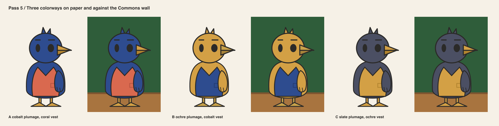
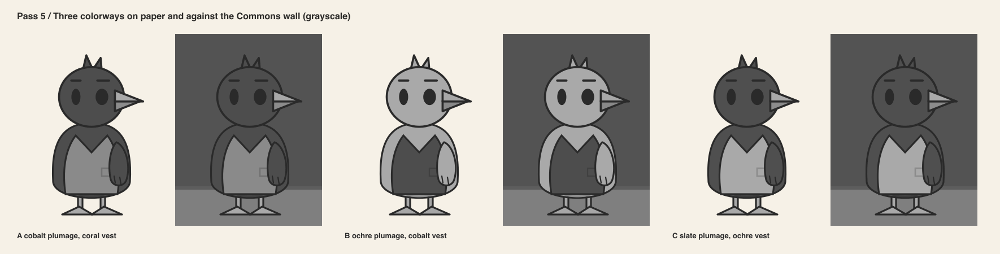
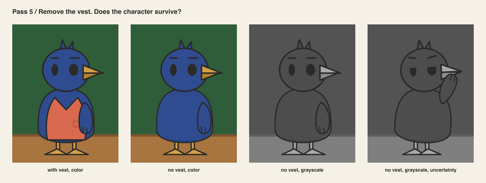
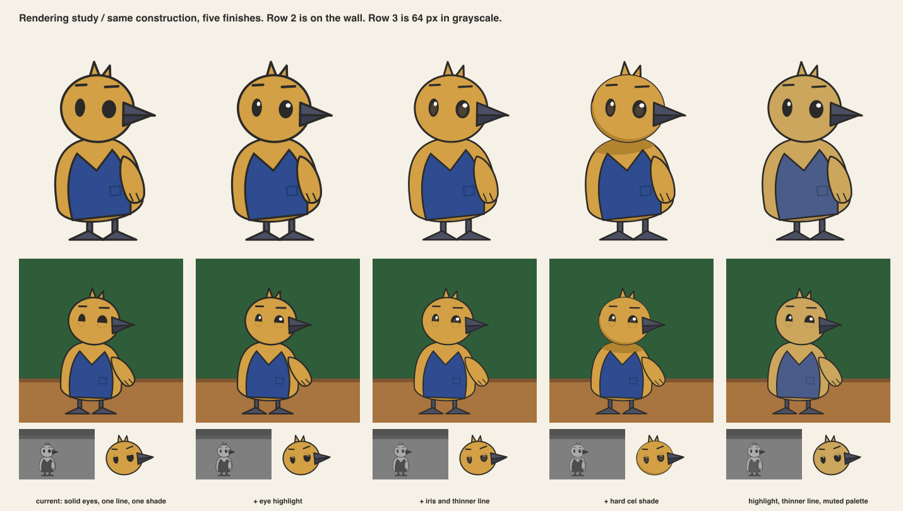

# Pass 5 / Costume, material and color

Author: AI in the role of concept artist.
Reviewers: AI in the role of art director, then AI in the role of technical artist, in
separate steps. Not human professional review.

## Costume

One garment: a vest folded from paper, with one pocket as its only detail. No hat, no
scarf, no glasses. The seating plan is a prop, not a costume, and appears only in poses.

## Colorways

Three colorways from the storyboard palette, on paper and against the forest green wall
with the wood table.

## Value against the wall

The technical artist measured luma for every fill. Luma here is the weighted sum
0.2126 R + 0.7152 G + 0.0722 B on 0 to 255 values. It is not a linearized figure. It is enough
to rank values.

| Fill | Hex | Luma | Against the wall (81) |
|---|---|---|---|
| wall green | #2F5D3A | 81 | reference |
| cobalt | #2E4C8F | 74 | same value, fails |
| slate | #4B4F63 | 80 | same value, fails |
| lighter cobalt | #4E6DB8 | 108 | 1.3x, weak |
| darker lilac | #7F6EA6 | 118 | 1.5x, passes |
| wood table | #A8743F | 123 | 1.5x |
| coral | #D9694F | 127 | 1.6x |
| ochre | #D3A045 | 164 | 2.0x, passes |
| brass | #C9A24A | 164 | 2.0x |
| cream | #EFE4CC | 229 | 2.8x |

The first storyboard put ink-blue plumage on the organizer. Its luma matches the wall.
At 48 px in grayscale the body vanishes and only the contour remains.

| Colorway | Result at 48 px, grayscale, on the wall |
|---|---|
| A cobalt plumage, coral vest | body lost, vest floats |
| A2 lighter cobalt | body faint |
| B ochre plumage, cobalt vest | body reads, beak merges with the head |
| B2 ochre plumage, cobalt vest, slate beak | body reads, beak reads |

## Decision

B2 is the organizer's colorway. Ochre plumage, cobalt vest, slate beak and feet. The AI art
director accepted it on the evidence above. This pass recommends retiring the storyboard's
ink-blue bird. A human reviewer makes that call.

A cast rule follows from the measurement. The largest fill of any character must be at
least 1.4 times the wall's luma. Or it must be at most 0.6 times it. Slate and cobalt fail this rule
for large areas. They remain available for garments and small parts, where a light body
surrounds them.

## Remove the vest

The sheet was made before the colorway decision and shows colorway A. In color, the
character survives without the vest: the beak, the tuft and the feet carry identity. In
grayscale on the wall, colorway A survives only by its contour. Colorway B2 does not have
this problem, which is the reason for the decision above. The finding stands for the cast.
A garment must never be the only thing that separates a character from the wall.

## Materials and rendering conventions

- Plumage and fur are matte painted wood.
- Garments are folded paper with one crease.
- Beaks, feet and rims are painted wood in a darker tone. Brass is reserved for the loupe.
- Each hue has one shade tone, used on the underside of the body. No gradients, no
  highlights, no textures.
- The contour is charcoal, 3.2 units wide at construction scale. It scales with the figure.
  At 64 px it is 0.8 px, which is the practical minimum.

## Rendering study after review, 2026-09-12

The product owner asked for a familiar, friendly finish in the manner of cozy life-sim
games and gentle animation. Five finishes on the same construction:

Adopted: one highlight per eye and a contour at 0.8 of the cycle-1 width. Rejected: an
iris, which is invisible at 64 px. Also rejected: a hard cel shade, which reads as a cast
shadow and fights the painted-wood story. The muted palette was carried into the owl in cycle 2. The wall and
table keep their storyboard colors until the storyboard is revised.

## Technical artist notes

- Ochre and brass have the same luma and nearly the same hue. Keep the loupe's brass rim
  narrow so that brass never becomes a large area.
- Contrast between the ochre body and the cream lens of the loupe is low in grayscale.
  They are separated by shape, not by value. Acceptable, and recorded.
