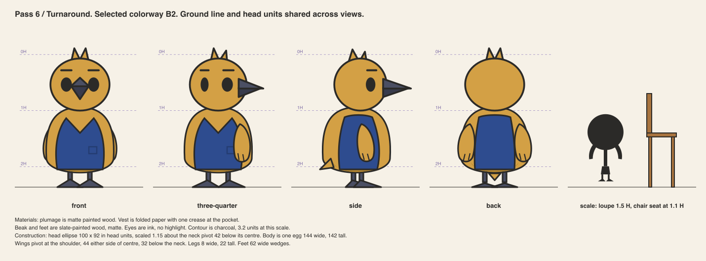

# Pass 6 / Turnarounds and model sheet

Author: AI in the role of character designer, with modeler notes.
Reviewer: AI in the role of art director, in a separate step. Not human professional review.

Front, three-quarter, side and back share one ground line, one neck pivot and one head
unit. All four views come from the same constants in `src/organizer.py`. If a constant
changes, every view changes.

## Scale reference

The loupe companion is 1.5 heads tall. A chair seat sits at 1.1 heads. The organizer can
rest a wing on a chair back without reaching up. The habit in pass 7 depends on this.

## Contradictions found and resolved

- The front beak was first a small diamond that read as a nose. It is now a taller
  two-tone wedge with the split line visible. It reads as a beak seen tip-on.
- The side vest had a V-notch copied from the front view. From the side there is no V.
  It is now a plain panel.
- The tail nub appears in the side and back views only. In front and three-quarter views
  the body hides it. This is deliberate and the modeler should keep it on the mesh.
- The wings are drawn behind the body in the back view, as in the front view. The
  modeler must not read this as a wing that flips.

## Material callouts

- Plumage: matte painted wood, ochre.
- Vest: folded paper, cobalt, one crease at the pocket.
- Beak and feet: painted wood, slate.
- Eyes: ink, no highlight.

## Construction notes for the modeler

- Head: ellipse 100 wide, 92 tall in head units, centred 42 above the neck pivot. The head
  group is scaled 1.15 about that pivot.
- Body: one egg, 144 wide, 142 tall, widest above the middle, top edge overlapping the head by 12.
- Shoulders: 44 either side of centre, 32 below the neck pivot.
- Legs: 8 wide, 22 tall. Feet: wedges 62 wide, 14 tall, splayed 10 degrees.
- Hips, the lean pivot: on the centre line, 24 above the ground.

## Reviewer notes

Accepted as a buildable description. Two things stay open for a 3D pass. First, how the beak
wedge meets the head ellipse in three dimensions. Second, whether the paper vest is a separate
shell or a painted region. See `08-rig-tests.md`.
