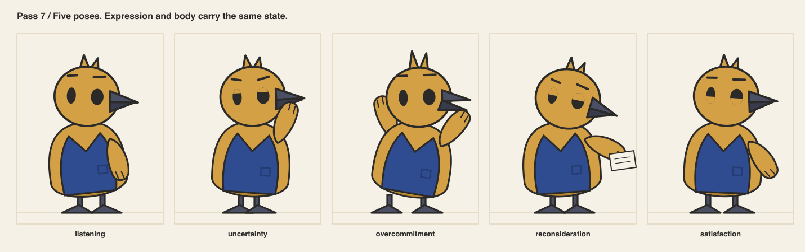
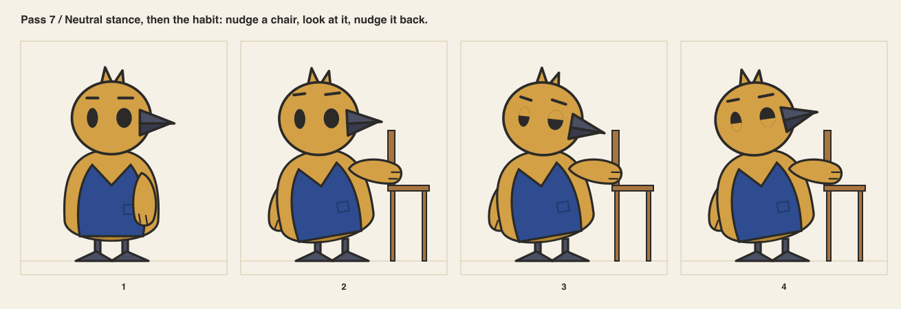
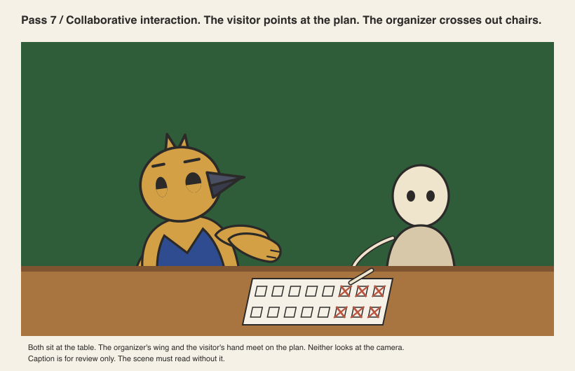

# Pass 7 / Expression and pose sheets

Author: AI in the role of animator, with rigging notes.
Reviewer: AI in the role of art director, in a separate step. Not human professional review.

## Five poses

Each pose pairs a body state with the matching face from pass 4.

| State | Body |
|---|---|
| listening | leans 6 degrees toward the visitor, wings down, head tilted |
| uncertainty | near wing to the beak, weight back, feet closer |
| overcommitment | both wings up and open, leaning back, feet wide |
| reconsideration | head down at the folded plan, held in the near wing |
| satisfaction | one wing on the hip, head level, squint |

The wing-to-beak gesture needed a test. At 120 degrees the wing points away from the
head and reads as presenting. At 160 degrees the tip meets the beak. 160 is the value.

## Neutral stance and the habit

Neutral stance: weight even, feet splayed, wings hanging slightly away from the body,
head level. The habit is one gesture in three beats: nudge a chair, look at it, nudge it
back. The chair moves six units and returns. Nothing else in the scene moves.

## Movement rhythm

Three tempos, in this order, every time:

1. **Commit.** Fast. A wing goes out or up in under half a second.
2. **Pause.** Long. Nothing moves for about a second. Lids may lower.
3. **Act.** Small and precise. A head tilt of a few degrees or a wing moving a few units.

This rhythm is the character. Other cast members must not share it. The source keeper is
slow, then slow. The loupe is quick, then quick.

## The collaborative interaction

The organizer and the visitor sit at the same table. The visitor's hand and the
organizer's wing meet on the seating plan. Three chairs are crossed out. Neither looks at
the camera. The visitor is a placeholder in neutral cream, because the visitor's own
character is not defined by this task.

The prior sheet failed this test by showing the bird alone. This panel passes it.

## Rules that came from this pass

- A pose must read from the outline at 40 px. Otherwise the interface uses a face at
  100 px or nothing.
- The organizer never faces the camera during a decision.
- Reconsideration always involves the plan. The organizer looks at the work, never at the
  visitor, when a correction lands.

## Reviewer notes

Accepted. One limitation recorded: satisfaction and listening share the same wing
position when the wing is on the hip. The face separates them, so the two states must
not be used at sizes below 64 px.
