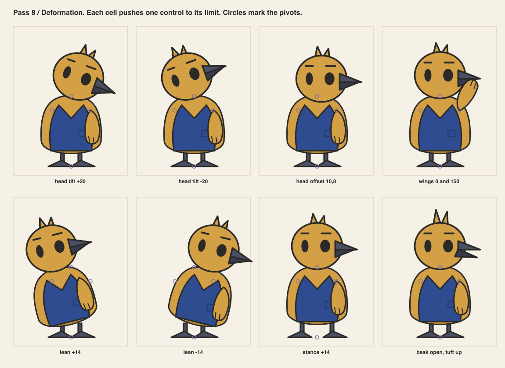

# Pass 8 / Rig tests

Author: AI in the role of rigger.
Reviewers: AI in the role of modeler, then AI in the role of technical artist, in separate
steps. Not human professional review.

## What this pass could and could not do

This session cannot build a 3D blockout. The ticket asks for one. In its place, this pass
built a two-dimensional rig with the same pivots the 3D rig would have. It pushed every
control to its limit. Seams and breaks found here are seams a 3D rig would also have to
solve. The 3D blockout stays open and is listed in `10-revisions.md`.

## Deformation sheet

| Control | Limit tested | Result |
|---|---|---|
| head tilt | plus and minus 20 degrees | no gap at the neck; the head overlaps the body by 12 |
| head offset | 10 across, 8 down | no gap; the far wing root stays hidden |
| wings | 0 and 150 degrees | the wing root shows over the vest at 150; acceptable |
| lean | plus and minus 14 degrees | see the bug below |
| stance | plus 14 | legs stay under the body |
| beak and tuft | fully open, tuft up | the lower wedge clears the upper; no overlap |

## The bug

The first lean rotated the whole figure about the midpoint of the feet. The feet left the
ground line. Every lean would have floated the character. The rig now rotates the upper
group about the hips, 24 above the ground. The legs and feet stay planted. The sheet
above shows the revised rig. The animation test in pass 9 inherits the fix.

## Hand and prop contact

The wing has no thumb. It grips by curling its tip around an object. Tested with the
folded plan in the reconsideration pose and with the chair back in the habit. Both work
because the object is thin. A mug or a ball would fail. Rule: props for the organizer are
paper, chair backs and pens.

## Silhouette from the camera

The storyboard's camera is three-quarter and slightly above the table. All sheets use the
three-quarter view. The top-down mobile worktable shows the character at 64 px or not at
all. At that size only the neutral and the overcommitment poses read.

## Export feasibility

The three-quarter rig exports as one SVG of 43 elements and under 4 KB. Every moving part
is a group with a class. See `09-animation-runtime.md` for the measurements.

## Open for a 3D pass

- The beak wedge meeting a spherical head.
- Whether the vest is a shell or paint.
- Deformation at the neck when the head both tilts and turns.
- Wing root when the wing rises above 120 degrees.
