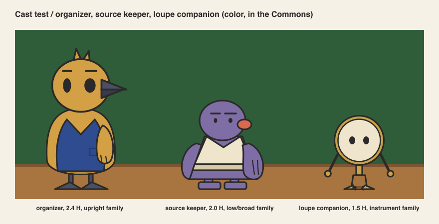
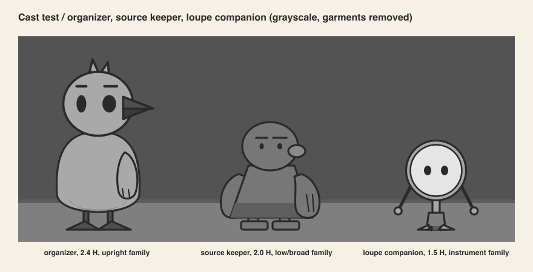
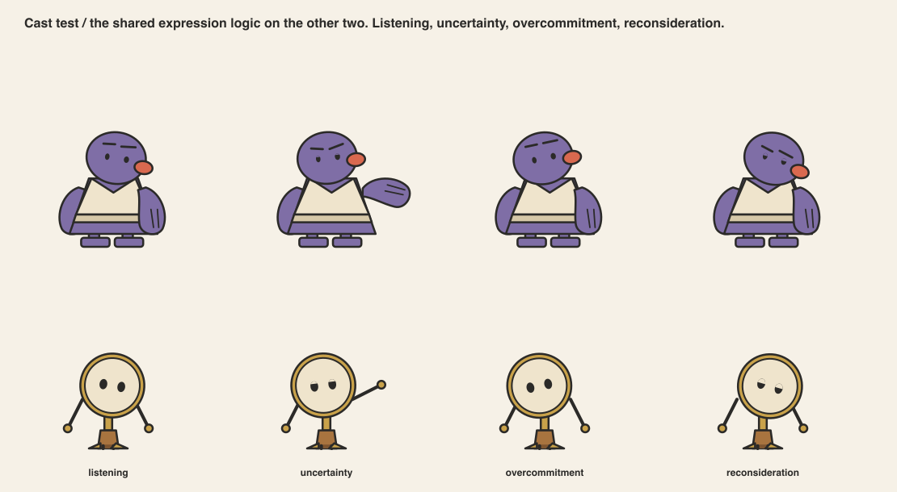
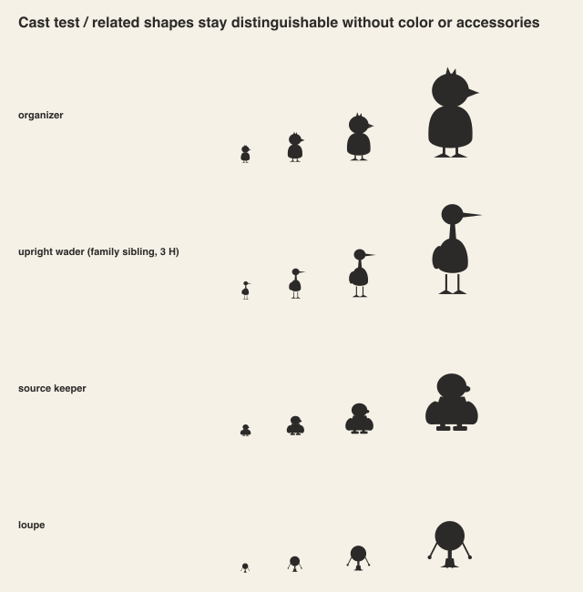

# Pass 10 / Cross-specialist revisions

Coordinator: AI in the role of art director. Not human professional review.

## The system tested on two supporting concepts

Two concepts that contrast with the organizer in silhouette family, motive and tempo.

**Source keeper.** Low and broad, 2.0 heads. Keeps the source notes. Motive: everything
on the sheet is true. Flaw: answers only what is asked and volunteers nothing. Relationship:
the visitor checks the assistant's draft against the keeper's notes. Tempo: slow, then slow.
Exception to the rules: dot eyes, so the brows act.

**Loupe companion.** Instrument, 1.5 heads. Already in the storyboard. Motive: notice the
small thing. Flaw: notices the wrong small thing. Relationship: guides the first visit and
points, never explains. Tempo: quick, then quick. Exception to the rules: no brows and no
mouth, so the rim tilt and the lids act.

## Findings and revisions, in order

| Found in | Finding | Revision | Status |
|---|---|---|---|
| pass 3 | S4's wings hugged the body and gave no acting range | wings pivot at the shoulder | closed |
| pass 3 | S5 reads as furniture and competes with scenery | rejected | closed |
| pass 4 | listening matched neutral | stronger tilt and brow lift | closed at 100 px, open at 64 px |
| pass 5 | cobalt plumage has the wall's luma | colorway B2, ochre plumage, slate beak | closed |
| pass 5 | ochre and brass share a luma | brass limited to the loupe's rim | closed |
| pass 6 | front beak read as a nose | taller two-tone wedge | closed |
| pass 6 | side vest carried a front-view notch | plain side panel | closed |
| pass 7 | wing at 120 degrees pointed away from the beak | 160 degrees | closed |
| pass 7 | first collaboration panel stood both figures behind the table | both seated, table in front | closed |
| pass 8 | lean rotated about the feet and floated them | lean pivots at the hips | closed |
| pass 9 | reduced-motion greeting looked like thinking | wing to 110 degrees | closed |
| pass 10 | keeper's slate fur had the wall's luma | fur is the darker lilac | closed |
| pass 10 | keeper cannot show overcommitment with the face | both spade hands rise instead | recorded as an exception |
| pass 10 | loupe's range is narrow, two or three states | accepted; the loupe points, it does not act | recorded as a limitation |
| pass 10 | visitor placeholder claimed lilac | placeholder is neutral cream | closed |
| review | reviewer asked for rounder, friendlier, closer to Animal Crossing | eyes 1.4x, head 1.15x, beak 0.7x, egg body; 2.4 heads; eye line kept at 50 % | closed, see `04-proportion-face.md` |
| review | reviewer asked for a familiar friendly finish | eye highlight and thinner line adopted; iris and cel shade rejected | closed, see `05-costume-color.md` |
| review | reviewer did not love the bird: species, face, flat look, stiffness | concepts generated, owl chosen, rebuilt under the rules | closed, see `13-owl-rebuild.md` |
| blockout | apron floated, belly poked through, disc bulged | all three became surface patches | closed, see `14-blockout.md` |
| review | reviewer asked for a sea otter and named the generated finish as the target | otter concepts, otter 2 chosen, rebuilt, blocked out; finish reference recorded | closed, see `15-otter-rebuild.md` |
| review | scarf blue | dusk blue in 2D and 3D | closed |
| otter blockout | arms sat inside the round body; tail lay detached on the ground | arms moved outside the body surface; tail base buried in the lower back | closed, see `16-otter-blockout.md` |

## Unresolved tradeoffs

- **Ochre body, cream lens.** The organizer and the loupe are both light. Shape separates
  them, value does not. Fine at the table, untested in a crowded square.
- **Small sizes and faces.** Below 64 px only body poses read. The interface must never
  depend on a facial state at avatar size.
- **The habit and the table.** The chair nudge needs a chair in frame. The mobile worktable
  has none, so on mobile the organizer has no habit. Either add a chair edge or accept it.
- **One reviewer, one model.** Every review here is the same model in a different role. The
  reviews found real problems, listed above, but they cannot replace a human art director.
- **Dark fur on a dark wall.** The otter's brown has the wall's luma. The face and chest carry it.
  The wall may need to lighten one step at the storyboard level.

## Acceptance criteria from the ticket

| Criterion | State | Evidence |
|---|---|---|
| Organizer identity and silhouette selected through documented alternatives and critique | met, pending human sign-off | `03-silhouettes.md` |
| Reads at interface sizes, in silhouette and grayscale | met at 40 px and above, partial at 24 px | `png/03-*`, `png/05-d-value-fixes.png` |
| Personality evident through pose and behavior without slogans | met, AI-judged only | `png/07-a-poses.png`, `png/07-c-gesture.png` |
| Turnarounds, expressions and poses describe the same buildable character | met by construction; one generator makes all of them | `src/organizer.py` |
| Two contrasting supporting concepts show a coherent cast system | met | `png/10-*` |
| Model, rig and animation tests resolve construction problems and document revisions | met; the 3D blockout found and fixed three problems | `08-rig-tests.md`, `09-animation-runtime.md`, `14-blockout.md` |
| Technical art review covers mobile performance, accessibility and fallback | met on one test page; not measured in a real scene | `09-animation-runtime.md` |
| Art director review records accepted decisions and remaining limitations | met, AI only | this file |
| Source files, sheets, test clips and rules organized for handoff | met; the "clips" are a live HTML page, not video | `README.md` |
| No design treated as approved because a generated image looks polished | met; no generated image was used | `README.md` |

## Next step

A human art director reads `CHARACTER-SYSTEM.md`, then `15-otter-rebuild.md` and `16-otter-blockout.md`.
They decide whether the otter proceeds to a name, production modeling and interface work. Frontend implementation
remains out of scope, as the ticket says.
