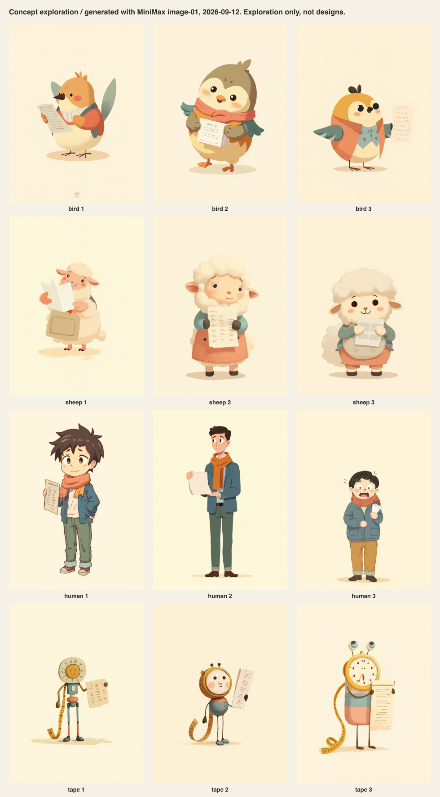
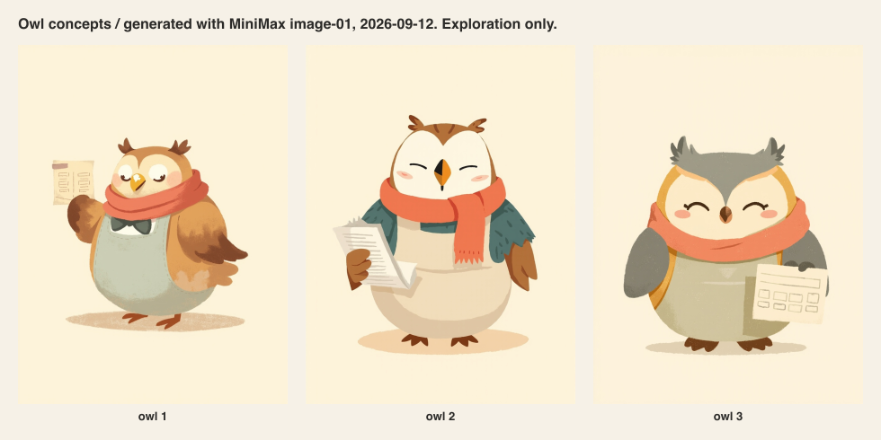
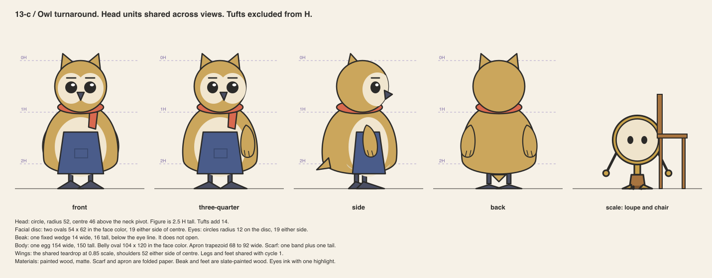
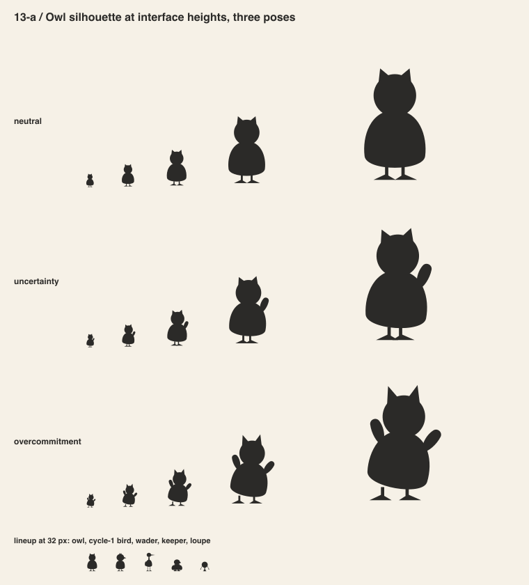
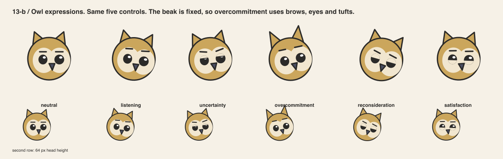
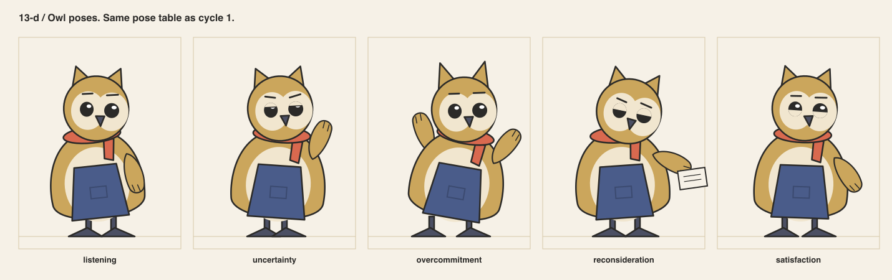
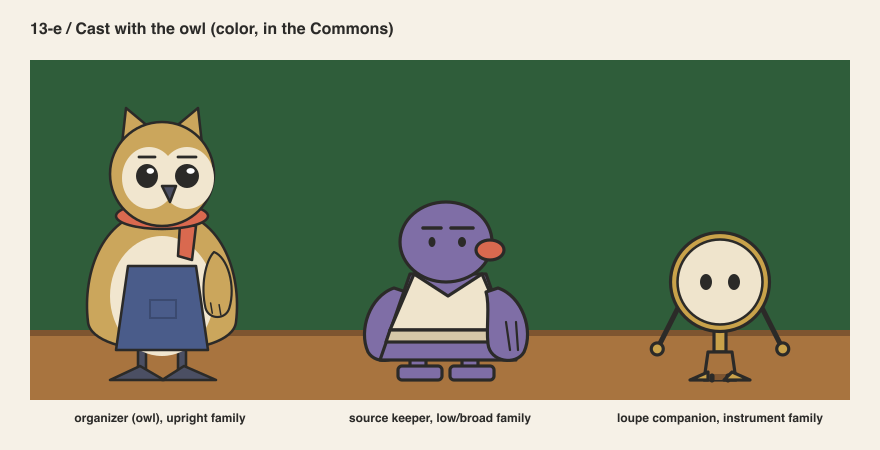
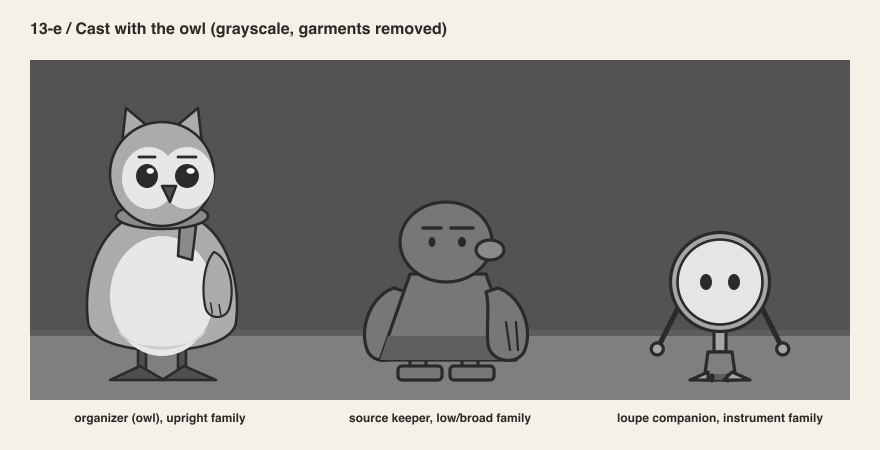
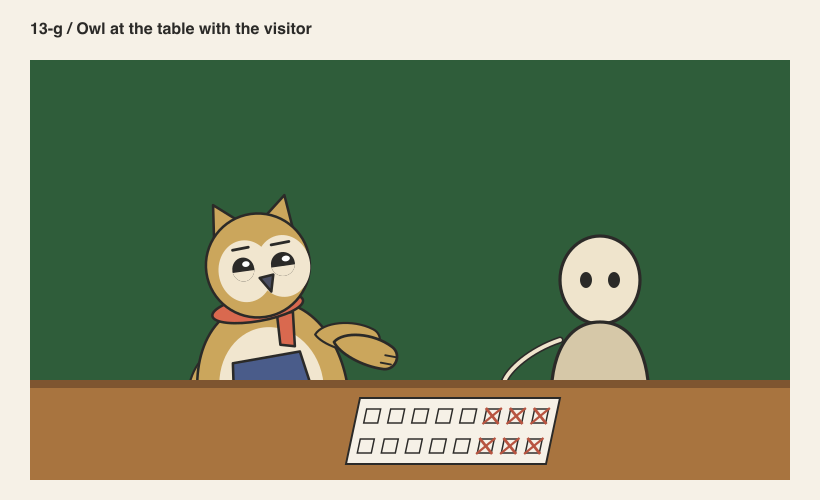
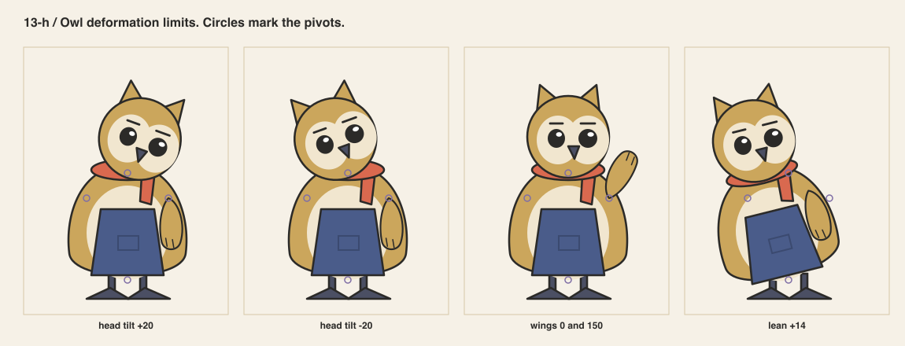

# Cycle 2 / The owl

Author: AI in the role of character designer.
Reviewer: AI in the role of art director, in a separate step. Not human professional review.
Direction from the product owner on 2026-09-12: make the organizer an owl.

## Why a second cycle

The product owner reviewed cycle 1 and did not love the bird. The species, the face, the
flat look and the stiffness all missed. They asked for a familiar, friendly character in the manner
of cozy life-sim games and gentle animation. The rules from cycle 1 stay. The character
changes.

## Concept exploration

Twelve concepts across four directions were generated with an image model, then three
owls. They are exploration, not designs, and they are labeled as generated in
`concepts/`. The product owner chose owl 2: round, cream and ochre, scarf and apron,
small hooked beak, clear ear tufts.

One flag, raised before generation and recorded here. A learning product with an owl
mascot invites comparison with a well-known language app. A cozy life-sim also has owls
on its museum staff. The rebuild avoids both: no green, no bow tie, no glasses, muted
palette, adult proportions, a scarf and an apron. A human reviewer should confirm the
distance is enough.

## The rebuild under the rules

The owl is constructed in `src/owl.py` with the same box, ground, pivots, expression
controls and pose table as cycle 1. Every sheet below comes from that one file.

| Rule | Kept or changed |
|---|---|
| eye line at 50 % | kept |
| solid ink eyes, lids carry expression | kept, with one highlight per eye |
| head unit and ratio | head is a circle; figure is 2.5 heads with the tufts excluded |
| wings pivot at the shoulder | kept, wings at 0.85 scale |
| lean pivots at the hips | kept |
| one garment, one detail | changed: apron plus scarf, declared as an exception |
| one plumage fill | changed: ochre back and cream face and belly, a pattern not shading |
| beak opens | changed: the beak is fixed; overcommitment uses brows, eyes and tufts |
| contour | thinner, 0.8 of cycle 1, from the rendering study |

## Silhouette

The tufts make the owl readable at 24 px. The uncertainty and overcommitment poses read
from 40 px. In the lineup the owl, the cycle-1 bird, the wader, the keeper and the loupe
stay separate at 32 px.

## Expressions and poses

The fixed beak costs one channel. Overcommitment still reads through brow lift, wide
eyes and raised tufts. At 64 px, listening and neutral merge, as they did in cycle 1.

## Cast and collaboration

The cream face and belly pass the wall rule from pass 5 with room to spare. The ochre
back sits at the same value as the wood table. So the owl must not stand in front of
the table edge at small sizes.

## Deformation

Head tilt, wings and lean behave as in cycle 1. The scarf tail crosses the raised wing
at 150 degrees. Acceptable, recorded.

## Rig

`animation-test.html` now runs the owl. Measured in Chrome on 2026-09-12: 48 elements and
4 016 bytes raw, 1 058 gzip. Two rigs ran at 61 frames per second. All five states and the
reduced-motion cuts work. The static fallback renders from `svg/organizer-static.svg`.

## Reviewer notes

Accepted for the 3D blockout. Two things to watch there. The facial disc is flat paint in
2D and must stay near-flush in 3D. The apron must wrap the belly rather than float in
front of it. See `14-blockout.md`.
