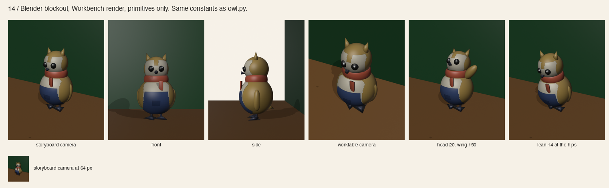

# Cycle 2 / 3D blockout

Author: AI in the role of modeler.
Reviewers: AI in the role of rigger, then AI in the role of technical artist, in separate
steps. Not human professional review.

Built in Blender 5.2 from `src/blockout.py`, which reads the same constants as the 2D
owl. Primitives only: spheres, cones, a torus and surface patches. Rendered with the
Workbench engine, flat object colors and an outline. It is a shape test, not a look test.

```
blender -b -P docs/design/character-system/src/blockout.py
```

Outputs: `png/14-blockout-*.png`, `models/organizer-blockout.glb` for three.js, and
`models/organizer-blockout.blend` as the source.



## What the blockout found

The first build failed in three places the 2D sheets could not show.

| Problem | What the render showed | Fix |
|---|---|---|
| apron | a flat slab standing away from the body, belly showing through it | the apron is a surface patch on the body sphere, one step larger, cut to a trapezoid |
| belly | a separate oval poking through the apron | the belly is a surface patch too, above the apron line |
| facial disc | two bulging lobes that read as goggles from the side | the disc is a surface patch on the head sphere with a notch at the top centre |

The rule that follows: in 3D, the two-tone plumage and the apron are paint on the form,
not added forms. Only the scarf, the tufts, the beak, the eyes and the wings stand off
the body.

## What holds from 2D

- The silhouette reads from the storyboard camera and from the steeper worktable camera.
- At 64 px the storyboard view still reads as an owl: tufts, round head, round body.
- Head tilt of 20 degrees at the neck leaves no gap. The head sphere sits inside the body's top.
- The near wing at 150 degrees pivots at the shoulder empty and clears the scarf.
- A lean of 14 degrees at the hips keeps both feet on the ground.

## Open for production modeling

- Patch borders are stepped, because they are cut from sphere vertices. A production
  mesh needs clean borders, either as material islands or as a painted texture.
- The eyes are spheres set into the disc. They bulge in profile. A production mesh should
  recess them slightly or flatten the front.
- The beak is a plain cone. The 2D hook is not modeled.
- The apron has no straps. The 2D drawing has none either, so decide whether it needs them.
- Wing grip on a prop is untested in 3D.

## Runtime notes for three.js

| Item | Value |
|---|---|
| glb size | see `models/`, under 600 KB with 160-segment spheres |
| parts | 22 meshes, 4 pivot empties |
| suggested production budget | one merged mesh under 4 000 triangles, one texture, under 200 KB |

The glb is a blockout and is not for shipping. The 2D rig remains the web asset until a
2D or 3D decision is recorded at the storyboard level.

## Reviewer notes

Accepted as a blockout. The three fixes above are the reason this pass exists. The
technical artist notes that the 160-segment spheres exist for clean patch edges in the
render. They must not go to production as they are.
