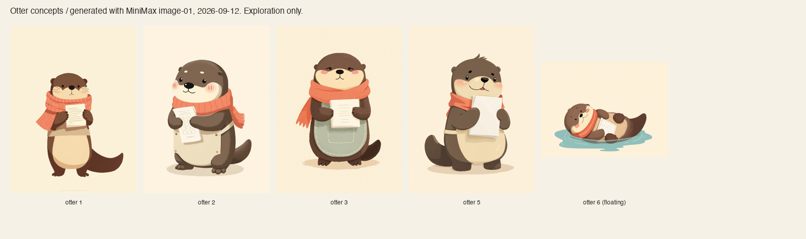
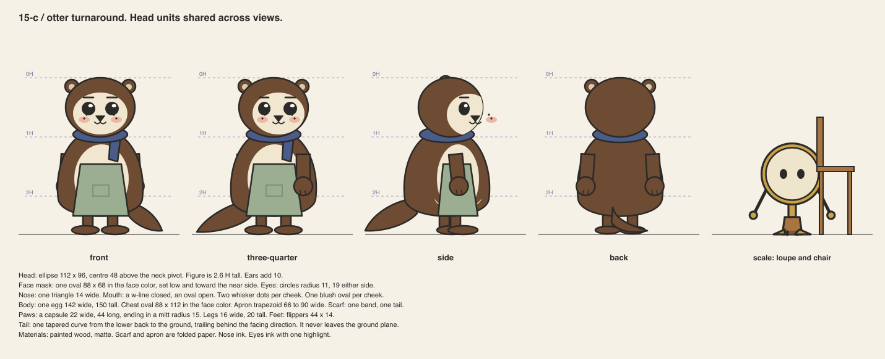
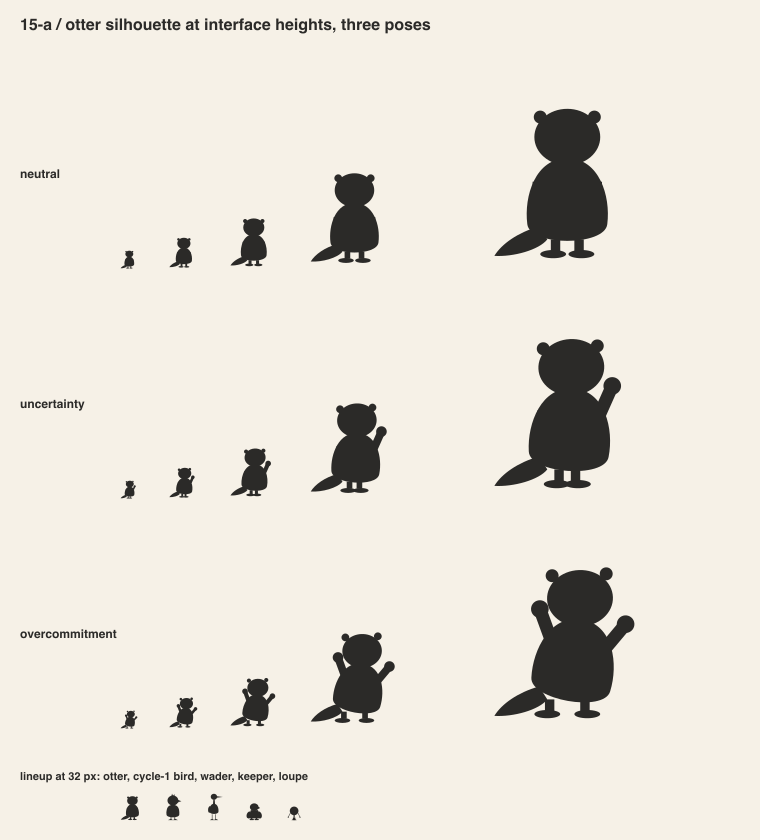
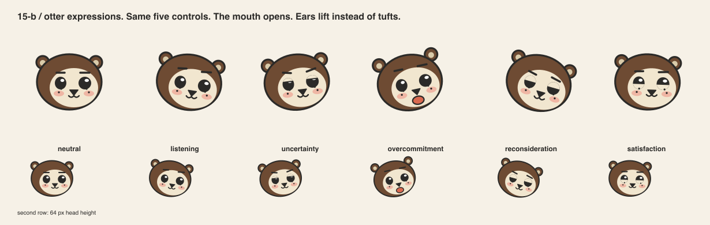
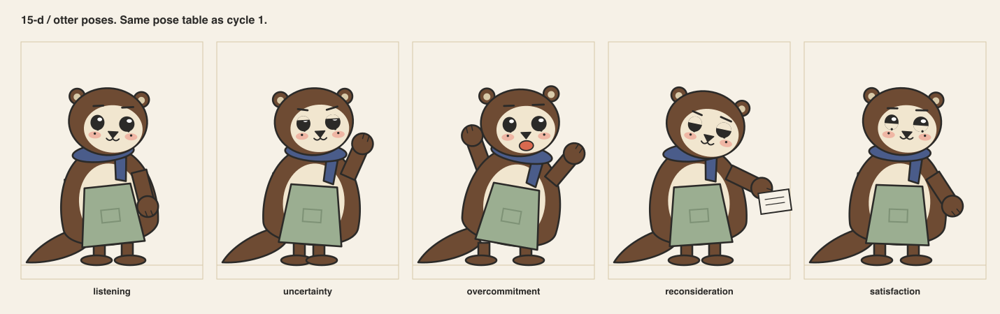
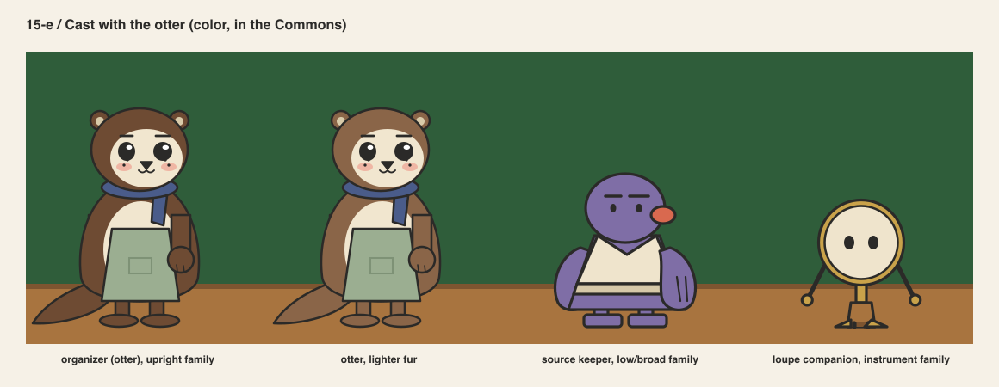
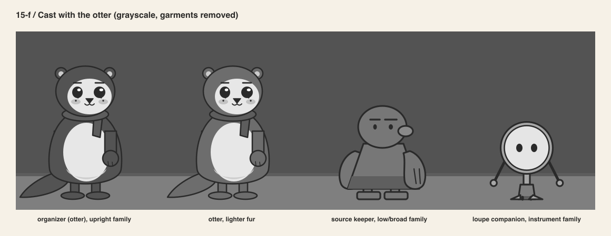
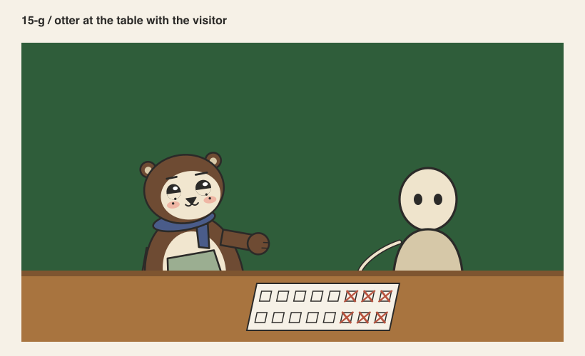
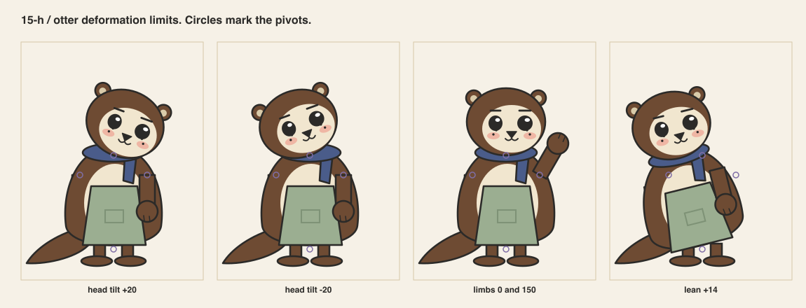

# Cycle 3 / The sea otter

Author: AI in the role of character designer.
Reviewer: AI in the role of art director, in a separate step. Not human professional review.
Direction from the product owner on 2026-09-12: make the organizer a sea otter, scarf blue.

## Why a third cycle

The product owner saw the owl in 2D and 3D and asked for a sea otter instead. They gave a
reference illustration for the feeling. Its qualities: a cream face oval on a dark body,
whisker dots, small round ears, mitten paws, a thick tail. The rules stay. The character changes.

The product owner also named the finish. The generated owl sheets in `concepts/` are
now the finish reference for production art. That finish means soft rounded forms, a thin
clean line, a muted warm palette, a blush on each cheek and a highlight in each eye. This folder still builds
construction, not finish. See `02-references.md`.

## Concept exploration

Six otters were generated in the same finish as the owls, five standing and one
floating. One download failed. The product owner chose otter 2.

## The rebuild under the rules

The otter is constructed in `src/otter.py`. Every sheet below comes from that file. The
sheet set is the same as the owl's, produced by `src/char_sheets.py`. The two
candidates were judged on identical tests.

| Rule | Kept or changed |
|---|---|
| eye line at 50 % | kept |
| solid ink eyes, lids carry expression, one highlight | kept |
| head unit and ratio | head is an ellipse 112 x 96; the figure is 2.6 heads, ears excluded |
| limbs pivot at the shoulder | kept; paws are capsules with a round mitt |
| lean pivots at the hips | kept |
| one garment, one detail | changed: sage apron plus dusk-blue scarf, declared |
| one fur fill | changed: brown body, cream face and chest, a pattern not shading |
| mouth | opens; overcommitment gets its mouth back |
| blush | one flat oval per cheek, from the finish reference |
| tail | new; it trails behind the facing direction and never leaves the ground plane |

## Silhouette

The tail is the otter's pointer. It reads at 24 px where the owl needed its tufts. The
uncertainty and overcommitment poses read from 40 px. In the lineup the otter, the cycle-1
bird, the wader, the keeper and the loupe stay separate at 32 px.

## Expressions and poses

The open mouth makes overcommitment the strongest state in the set. Listening and neutral
still merge at 64 px, as in every cycle.

## Cast, value and collaboration

The brown fur has the luma of the forest-green wall. In grayscale the body is held by its
contour and by the cream face and chest. A lighter fur was tested beside it and helps
only a little. The concept's dark brown is the product owner's ask, so it stays. Two
consequences are recorded. The wall may need to lighten one step when the storyboard is
revised. The otter must not stand in front of the table edge at small sizes.

## Deformation

## Rig

`animation-test.html` now runs the otter. Measurements are in `16-otter-blockout.md`
beside the 3D figures. All five states and the reduced-motion cuts work.

## Reviewer notes

Accepted for the blockout. Watch the paws in 3D. Capsule arms placed at the 2D shoulder
x-positions will sit inside a round body.
