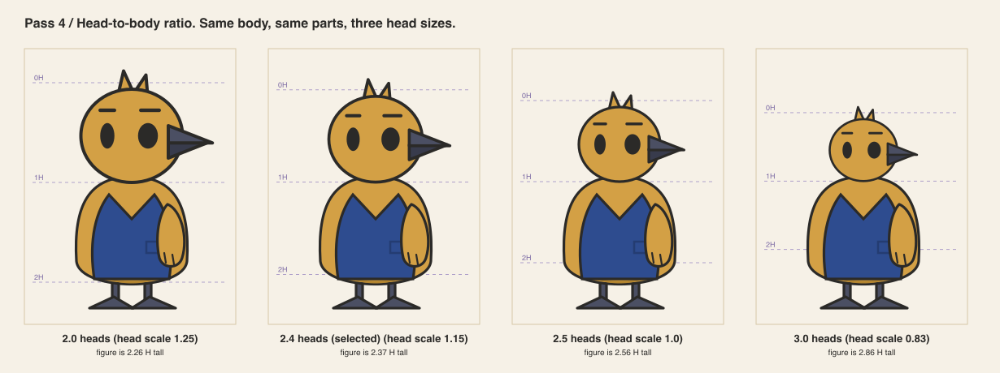
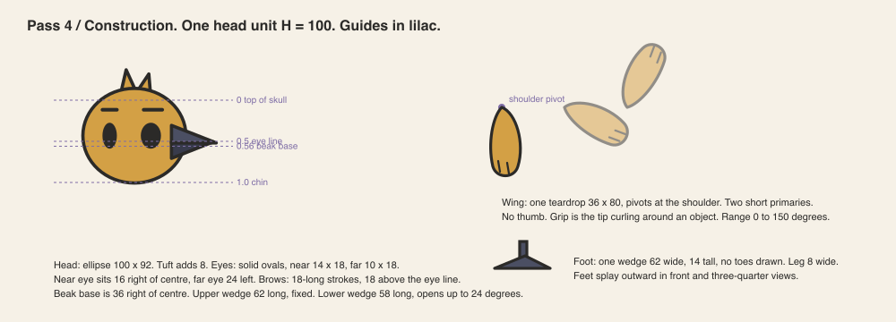
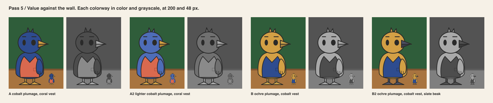
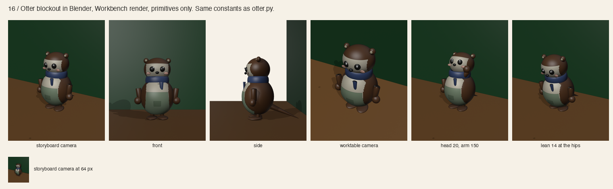

# The Foray Commons character system

The rules that make one cast. Every rule was tested on the organizer and checked on two
supporting concepts. The evidence is in the numbered pass documents in this folder.
Reviews are AI reviews in named roles, not human sign-off.

The organizer is the sea otter from cycle 3. The cycle-1 bird and the cycle-2 owl remain
in the folder. They are the record of how the rules were found and tested. The finish reference
for production art is `concepts/owl-sheet.png`, chosen by the product owner.

## 1. Head and body ratios

- One head unit H is the height of the head without hair or tuft.
- The cast lives between 1.5 and 3.0 heads tall. The organizer is 2.6, ears excluded.
- Instruments may be 1.5. Low and broad animals are 2.0. Upright animals are 2.2 to 3.0.
- Rounder is friendlier. The organizer moved from 2.5 to 2.4 heads after review, with larger
  eyes, a shorter beak and an egg body. See `png/11-friendly-variants.png`.
- Body width is at most 1.2 H for upright figures and at most 1.4 H for low figures.

## 2. Eye placement, face construction and expression logic

- The eye line sits at 50 % of head height. This holds when the head is a lens.
- Eyes are solid ink ovals. No pupil, no highlight. The near eye is larger than the far eye.
- Eyes are large, about a quarter of the head's width, with one highlight each.
- Lids carry the expression. A lid is a plumage-colored cover from the top or from the bottom.
- Brows are short strokes that lift and rotate. They are the only line on the face.
- A mouth or beak is two shapes. Only the lower one moves.
- Five controls make every expression: head tilt, brow lift, brow angle, lid coverage, mouth opening.
- Exceptions must be declared. Dot eyes give the acting to the brows. No mouth gives it to the limbs.

## 3. Silhouette families, limbs, hands and scale

Three families. A new character joins one of them or argues for a fourth.

| Family | Outline | Example | Heads |
|---|---|---|---|
| upright | egg body, one pointer (beak, tufts or tail), planted feet | organizer | 2.2 to 3.0 |
| low and broad | trapezoid body, big hands, flat feet | source keeper | 2.0 |
| instrument | one rigid shape on sticks | loupe companion | 1.5 |

- A silhouette must read in solid black at 24 px and its poses at 40 px.
- Limbs are single shapes that pivot at one point. A wing is a teardrop. An arm is a rod.
- Hands have no thumb. A wing grips by curling its tip. A spade hand pushes. A stick hand points.
- Feet are wedges or slabs, with no toes.
- Every character is drawn on the same ground line at the same scale. A chair seat is 1.1 H of the organizer.

## 4. Costume, palette, materials and rendering

- One garment per character. One detail on it. No accessories worn on the body. The
  organizer's scarf is its one detail, declared as an exception.
- Props are paper, chair backs and pens. They appear in poses, never in silhouette tests.
- Palette: forest green anchors cobalt, coral, ochre, lilac and cream, on warm paper.
- The largest fill of a character is at least 1.4 times the wall's luma. Or it is at most 0.6 times it.
  Cobalt and slate fail this for bodies. They are used for garments and small parts only.
- Each hue has one shade tone, used on the underside. No gradients, no highlights, no textures.
- Materials: painted wood for bodies and folded paper for garments. Beaks and feet are painted wood
  in a dark tone. Brass is for the loupe's rim only.
- Contour is charcoal, 2.6 units at construction scale, and scales with the figure.
- In 3D, two-tone plumage and garments are paint on the form, not added forms.
- Remove the garment and the color. The character must still be that character.

## 5. Movement rules and personality exceptions

Shared rules:

- Only transforms move: rotate, translate, scale, opacity. Never path data.
- Pivots: neck, two shoulders, hips. Legs and feet stay planted when the body leans.
- Idle is breathing and a blink. Nothing else.
- Reduced motion turns every state into a cut to its end pose.
- Motion belongs to the playful surface. It never reacts to the scoring key.

Personality is a tempo, and each character owns one:

| Character | Tempo | Habit |
|---|---|---|
| organizer | commit fast, pause long, act small | nudges a chair, then nudges it back; the tail settles last |
| source keeper | slow, then slow | taps the sheet once before answering |
| loupe companion | quick, then quick | zooms on the wrong detail, then the right one |

## 6. Related characters that stay distinguishable

An upright wader shares the organizer's family. It differs in head ratio, beak shape and
leg length. It stays separate at 40 px without color or accessories. The keeper and
the loupe sit in other families and separate at every size.

## Budgets

| Item | Limit |
|---|---|
| shapes per view | 10 |
| elements per rig | 120 |
| rig SVG, gzip | 12 KB |
| concurrent idle rigs | 4 in the square, 1 at the table |
| animated properties | transform and opacity |

## What is not decided

- The organizer's name.
- A one-step lighter wall, if the dark fur is to read at small sizes without its contour.
- Whether the Commons ships in 2D or 3D. The blockout exists; production modeling does not.
- Any character beyond the organizer. The keeper and the loupe are tests, not a cast.
- Human review of everything above.
